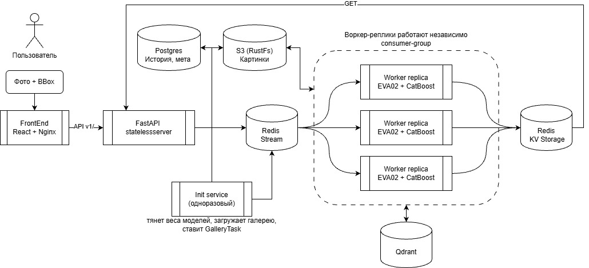

# LCT Falcon Tech - визуальный поиск автомобиля по изображению

На вход - фотография и bbox одной машины. На выход - все изображения **этого же
физического автомобиля** из галереи, отсортированные по убыванию близости. Если
уверенного совпадения нет, сервис честно отвечает «в галерее этой машины нет».

Поиск идёт **только по внешнему виду**: номера в датасете заблюрены и не используются как признак ни прямо, ни косвенно.

## Команда «Team Spirt»

| Участник | Роль |
| --- | --- |
| [Груздев Александр](https://github.com/gruzdev-as) | ML Engineer + Captain|
| [Рыжычкин Кирилл](https://github.com/l1ghtsource)   | ML Engineer |
| [Литвинов Максим ](https://github.com/maksimlitvinov39kg)  | ML Engineer |

- [Как запустить расчёт сабмита](#как-запустить-расчёт-сабмита)
- [Как это устроено](#как-это-устроено)
- [Поток поискового запроса](#поток-поискового-запроса)
- [Индексация галереи](#индексация-галереи)
- [Модель и режим отказа](#модель-и-режим-отказа)
- [Инференс: демо и продакшн](#инференс-демо-и-продакшн)
- [Что где хранится](#что-где-хранится)
- [Запуск](#запуск)
- [API](#api)
- [Конфигурация](#конфигурация)
- [Структура репозитория](#структура-репозитория)

---

## Как запустить расчёт сабмита

Сабмит считается **не сервисом**, а отдельным docker-образом `retrieval` из сабмодуля `training/`. Одна команда эмбеддит тестовые query и gallery и пишет три файла для проверки. Подробная документация - в [training/README.md](training/README.md), раздел *Contest Docker image*.

**Что нужно:** Docker с доступом к GPU (`--gpus all`, NVIDIA Container Toolkit), Git LFS для весов. Сеть нужна только на `docker build`, сам расчёт идёт полностью офлайн.

**1. Сабмодуль и веса.** Веса `eva02.pt` и `eva02_catboost.cbm` лежат в `training/weights/finetuned/` через Git LFS и запекаются в образ при сборке:

```bash
git submodule update --init
cd training
git lfs pull
```

Если `git lfs pull` не сработал и вместо весов остались файлы-указатели, скачайте `eva02.pt` и `eva02_catboost.cbm` с [Hugging Face](https://huggingface.co/lightsource/eva_mad_model) и положите в `training/weights/finetuned/`. Контрольные суммы сверяет сборка образа, вручную - `python3 scripts/verify_weights.py --root weights/finetuned`.

**2. Данные.** В `training/data/` (или в каталоге из `DATA_ROOT`):

```
data/
├── test_query.csv
├── test_gallery.csv
└── images/
```

CSV - колонки `image_id,x,y,w,h`: `image_id` - имя файла в `images/`, bbox - `xywh` в
пикселях от левого верхнего угла. Если у `image_id` нет расширения, ищутся `.jpg`,
`.png`, `.jpeg`.

**3. Сборка и расчёт** - из каталога `training/`:

```bash
docker compose build
DATA_ROOT=./data OUTPUT_DIR=./runs/submission docker compose run --rm retrieval
```

То же без компоуза:

```bash
docker run --gpus all --network none \
  -v "$PWD/data:/data:ro" \
  -v "$PWD/runs/submission:/runs/submission" \
  retrieval
```

**4. Результат** - в `training/runs/submission/`:

| Файл | Что внутри |
| --- | --- |
| `submission.csv` | Топ-10 галереи на **каждый** query: `query_id,gallery_id_1,...,gallery_id_10`, без заголовка |
| `candidates.csv` | Решения режима отказа: `query_id,gallery_id,confidence`, с заголовком. У отклонённого query строк нет |
| `embeddings.npy` | float32, L2-нормированные 256-мерные эмбеддинги: сначала `test_query.csv`, затем `test_gallery.csv`, в порядке файлов |

Сабмит считается той же моделью и тем же пресетом отказа (`eva02_ensemble`), что и сервис ниже. Для ориентира: на RTX A5000 полный прогон (1110 query + 750 gallery) занимает ~2.5 минуты с холодного старта, повторные прогоны дают одинаковый результат.

---

## Как это устроено

### Четыре стадии

Этой терминологией пользуемся в коде, логах и документации.

| Стадия | Что происходит | Где |
| --- | --- | --- |
| **Ingestion** | Приняли картинку и bbox, провалидировали, положили оригинал в S3 | `backend` |
| **Processing** | Кроп по bbox, модель, L2-нормированный эмбеддинг float32 | `inference` |
| **Analysis** | Векторный поиск top-k по галерее в Qdrant, решение об отказе | `inference` |
| **Result** | Сортировка по убыванию близости, top-N - или пусто с `rejected: true` | `inference` → `backend` |

**Режим отказа - часть контракта.** Если лучший кандидат не прошёл порог, ответ - пустой список и флаг `rejected: true`. 

### Компоненты



| Сервис | Роль |
| --- | --- |
| `backend/`   | FastAPI-шлюз: приём и валидация, постановка задачи, отдача результата, история в Postgres |
| `inference/` | Воркер Redis Streams: кроп → эмбеддинг → поиск в Qdrant → отказ → запись результата. Также считает эмбеддинги галереи |
| `init/`      | Одноразовый bootstrap: скачивает веса, заливает галерею в S3 и Postgres, ставит её в очередь на эмбеддинг |
| `common/`    | Общий код: контракты, константы, ORM-модели, клиенты Redis / Qdrant / S3, логирование |
| `frontend/`  | React + TypeScript (Vite), в контейнере - nginx, который проксирует `/api/` |
| `training/`  | Сабмодуль [Vehicle-ReID](https://github.com/l1ghtsource/Vehicle-ReID): эксперименты и код модели, который inference ставит как пакет |
| `data/`      | Bind-mount'ы для томов компоуза, веса и галерея.|

| Инфраструктура | Зачем | Образ |
| --- | --- | --- |
| Redis Streams | Шина задач и ключи статуса/результата    | `redis:7.4.11-alpine`      |
| Qdrant        | Векторы галереи                          | `qdrant/qdrant:v1.19.1`    |
| Postgres      | Метаданные галереи и история поисков     | `postgres:17.6-alpine`     |
| RustFS (S3)   | Оригиналы изображений: запросы и галерея | `rustfs/rustfs:1.0.0-rc.6` |

## Поток поискового запроса

Поиск асинхронный: API сразу отдаёт `task_id`, клиент опрашивает результат.

```
POST /api/v1/search   (multipart: file, bbox, top_k)
  ├─ валидация картинки и bbox                        [ingestion]
  ├─ оригинал в S3 под queries/                       [ingestion]
  ├─ SET  task:{id} = pending   (TTL 1 час)
  ├─ XADD falcon:tasks  EmbeddingTask
  ├─ INSERT search_queries      (best effort)
  └─ 202 {"task_id": "..."}

        inference (consumer group inference-workers)
          ├─ SET task:{id} processing
          ├─ читает оригинал из S3, кроп по bbox, эмбеддинг     [processing]
          ├─ top-k в Qdrant, решение об отказе                  [analysis]
          ├─ SET result:{id} = SearchResult, DEL task:{id}      [result]
          └─ XACK

GET /api/v1/search/{task_id}
  ├─ есть result:{id}  → UPDATE search_queries + INSERT search_candidates (один раз)
  │                    → 200 + кандидаты
  ├─ есть task:{id}    → 202 {"status": "processing"}
  └─ нет ничего        → 404
```

## Индексация галереи

Чтобы начать работу с сервисами необходимо примонтировать галерею и получить её эмбеддинги. Каталог (`GALLERY_DIR`, по умолчанию `./data/gallery`) с `manifest.csv` и
`images/` монтируется в контейнер как `/gallery`. Как его собрать и что должно быть в манифесте - в разделе [Подключить галерею](#2-подключить-галерею).

Порядок старта в компоузе:

```
init ──► inference (×N) ──► gallery-ready ──► backend ──► frontend
```

1. **init** скачивает веса EVA02 и CatBoost-голову в `data/weights`, заливает оригиналы в S3 под `gallery/`, пишет `gallery_images` в Postgres, сверяет Qdrant и на каждое недостающее изображение публикует `GalleryTask` в `falcon:gallery`. В `gallery:state` записывает, как должна выглядеть готовая галерея (`model_version`, `total`). Затем завершается.
2. **inference** в свободное от поисков время берёт по одному изображению галереи, считает эмбеддинг и делает upsert точки в Qdrant. Битые изображения попадают в `gallery:failed` и пропускаются.
3. статус **gallery-ready** (`python -m init.app.wait`) опрашивает прогресс, пишет в лог скорость и ETA, предупреждает, если ничего не движется `INIT_WAIT_STALL_S` секунд, и выходит с кодом 0, когда каждое изображение проиндексировано или пропущено.
4.После этого стартует **backend*

На CPU индексация занимает ~1–3 с на изображение, так что первый старт может быть долгим - смотрите логи `gallery-ready`. Хорощая и правильная альтернатива - запускать на GPU. Сейчас индексация работает по одному изображению за раз, чтобы не перегружать код воркера, но для продакшн решения можно и нужно сделать батчевую обработку.

**Версия модели.** Каждая точка в Qdrant несёт `model_version` - sha256 файла весов. Воркер с другими весами задачу галереи не возьмёт.

**Идемпотентность.** Каждый шаг проверяет, что уже лежит в хранилище: скачанные веса, загруженные объекты, строки этой версии манифеста, точки с текущей `model_version`.
Повторный `up` - быстрый no-op, а новые веса сами пересобирают галерею (точки от старых весов и от удалённых из манифеста изображений вычищаются).

Полный пересчёт с нуля:

```bash
INIT_FORCE=true docker compose up -d        # или: docker compose run --rm init --force
```

---

## Модель и режим отказа

**Эмбеддер** - `INFERENCE_EMBEDDER=eva02`: EVA02-L (LLM2CLIP, 336×336) с ArcFace/AdaSP-головой из `training/`, вектор размерности 256. Чекпоинт `eva02.pt` init скачивает с Hugging Face.

**Режим отказа** настраивается пресетом из `training/configs/refusal/`, пороги подобраны под текущие веса и лежат рядом с ними:

| Пресет | Когда отвечаем |
| --- | --- |
| `eva02_ensemble.yaml` *(по умолчанию)* | лучший косинус ≥ `cosine_threshold` **и** CatBoost P(машина есть в галерее) ≥ `model_threshold` |
| `eva02_model.yaml` | только CatBoost-голова |
| `eva02_threshold.yaml` | только косинусный порог |

CatBoost-голова отвечает на вопрос «есть ли эта машина в галерее вообще» - одно число на запрос. 

`INFERENCE_REJECT_THRESHOLD` - ручной override: отказ по одному косинусу с этим порогом, пресет игнорируется. В штатном режиме оставляйте пустым.

---

## Инференс: демо и продакшн

**Сейчас воркеры считают всё сами.** Каждая реплика `inference` при старте загружает EVA02 в свой процесс (~1.2 ГБ), берёт из стрима строго одну задачу и прогоняет модель
локально, на CPU или GPU. Батчинга нет, пропускная способность растёт числом реплик. Такое решение принято сугубо для демонстрации работоспособности и не отражает реальную пропускную способность модели. 

**Для продакшна рекомендуем [NVIDIA Triton Inference Server](https://github.com/triton-inference-server/server).**
Под реальной нагрузкой он даёт то, чего нет у воркера с моделью внутри:

- **dynamic batching** - одновременные запросы от всех воркеров собираются в один батч на GPU, а не идут по одному;
- **одна копия весов на GPU** вместо копии в каждой реплике, несколько инстансов модели на одной карте;
- оптимизированные бэкенды (TensorRT, ONNX Runtime) и готовые метрики Prometheus по очередям и латентности.

Архитектуру это не меняет. Triton подключается как ещё одна реализация `Embedder` в `inference/src/models/factory.py`: воркер по-прежнему читает Redis Streams, ищет в
Qdrant и принимает решение об отказе, а вместо локального forward pass отправляет кроп в Triton по gRPC.

**Почему в демо мы так не сделали.** В тестовом сценарии на локальном железе Triton не даёт выигрыша: запросы идут по одному, батчу собираться не из чего, а на одной
машине он лишь добавляет ещё один сервис и сетевой переход на каждый запрос. 

---

## Что где хранится

| Хранилище | Что | Кто пишет |
| --- | --- | --- |
| **Redis** `falcon:tasks` | Стрим поисковых задач `EmbeddingTask` | backend |
| **Redis** `falcon:gallery` | Стрим задач индексации `GalleryTask` | init |
| **Redis** `task:{id}` | Маркер «задача в работе», TTL 1 ч | backend, inference |
| **Redis** `result:{id}` | Готовый `SearchResult`, TTL 1 ч | inference |
| **Redis** `gallery:state`, `gallery:failed` | Ожидаемое состояние галереи и пропущенные изображения | init, inference |
| **Qdrant** `gallery` | Векторы галереи; payload: `image_id`, `image_path`, `vehicle_id`, `camera_id`, `bbox`, `model_version` | inference |
| **Postgres** `gallery_images` | Метаданные галереи, `gallery_version` = хеш манифеста | init |
| **Postgres** `search_queries` | Каждый поиск: bbox, параметры кадра, статус, `top_score`, `rejected`, латентность | backend |
| **Postgres** `search_candidates` | Кандидаты каждого поиска с рангом и скором | backend |
| **S3** `queries/`, `gallery/` | Оригиналы запросов и галереи | backend, init |

Id точки в Qdrant - `uuid5` от `image_id` (Qdrant принимает только uint64 или UUID), настоящий id лежит в payload.
Схему Postgres создаёт init из ORM-моделей через `create_all`.

---

## Запуск

### Что нужно

- Docker с Compose v2;
- для GPU - NVIDIA Container Toolkit (опционально, без него всё работает на CPU);
- ~1.2 ГБ на диске под веса и столько же RAM на каждую реплику inference;
- для локальной разработки - Python 3.12, [uv](https://docs.astral.sh/uv/), Node.js.

### 1. Код и сабмодуль

```bash
git clone --recurse-submodules <repo-url>
# или в уже склонированном репозитории:
git submodule update --init
```

### 2. Подключить галерею

Галерея - это каталог на хосте с двумя вещами: файлом `manifest.csv` и папкой `images/`.

**Шаг 1. Разложите файлы.** По умолчанию каталог - `data/gallery/` в корне репозитория:

```
data/gallery/
├── manifest.csv
└── images/
    ├── df7ea50171af48df81584ab7e8107d15.jpg
    ├── e79ae27b52fa4d54aa37735fd275c66e.jpg
    └── camera_03/                  # подкаталоги тоже можно
        └── 000123.png
```

Если галерея лежит в другом месте, копировать её не нужно - укажите путь в `.env`:

```bash
GALLERY_DIR=/mnt/datasets/falcon-gallery   # абсолютный или относительно корня репозитория
```

Компоуз монтирует этот каталог в init как `/gallery`, только на чтение.

**Шаг 2. Составьте `manifest.csv`.** Одна строка - одно изображение галереи:

```csv
image_id,image_path,vehicle_id,camera_id,bbox_x,bbox_y,bbox_width,bbox_height
df7ea50171af48df81584ab7e8107d15,df7ea50171af48df81584ab7e8107d15.jpg,,,1202.0,265.0,588.0,482.0
e79ae27b52fa4d54aa37735fd275c66e,e79ae27b52fa4d54aa37735fd275c66e.jpg,17,cam_1,804.0,242.0,944.0,563.0
000123,camera_03/000123.png,42,camera_03,10,20,300,180
```

| Колонка | Обязательна | Что это |
| --- | --- | --- |
| `image_id` | да | Уникальный id изображения, любая строка. Возвращается в ответе как `candidates[].image_id` |
| `image_path` | да | Путь к файлу **относительно `images/`**, а не относительно корня галереи |
| `vehicle_id` | колонка - да, значение - нет | Id машины, если известен. Можно оставить пустым |
| `camera_id` | колонка - да, значение - нет | Id камеры, если известен. Можно оставить пустым |
| `bbox_x`, `bbox_y` | да | Левый верхний угол машины на кадре, в пикселях исходного изображения |
| `bbox_width`, `bbox_height` | да | Ширина и высота bbox в пикселях, каждая ≥ 16 |

Правила:

- кодировка UTF-8 (BOM допустим), разделитель - запятая, первая строка - заголовок;
- все восемь колонок должны быть в заголовке; порядок не важен, лишние колонки игнорируются;
- bbox обязателен в **каждой** строке, формат тот же, что в запросе: `xywh` в абсолютных пикселях от левого верхнего угла;
- в галерее хранятся **целые кадры**, а не кропы: модель сама вырежет машину по bbox ровно так же, как для запроса;
- `image_id` не повторяются, каждый `image_path` указывает на существующий файл;
- форматы изображений - JPEG, PNG, WebP, BMP.

`vehicle_id` и `camera_id` в поиске не участвуют, они только возвращаются в ответе, чтобы по выдаче было видно, та ли это машина.

### 3. Окружение

```bash
cp .env.example .env
```

Дефолтов хватает для запуска.

### 4. Поднять всё

```bash
docker compose up --build -d
docker compose logs -f gallery-ready     # прогресс индексации галереи
```

Когда `gallery-ready` завершится, поднимутся backend и frontend.

```bash
# на GPU
docker compose -f docker-compose.yaml -f docker-compose.gpu.yaml up --build -d

# больше воркеров (одна consumer group, каждый держит свою копию модели)
INFERENCE_REPLICAS=4 docker compose up -d
```

На CPU с несколькими репликами ограничьте потоки: `INFERENCE_TORCH_THREADS` ≈
число ядер / число реплик, иначе реплики дерутся за процессор.

### Куда заходить

| Что | Адрес |
| --- | --- |
| **Фронтенд** | http://localhost:8080 (в компоузе) или http://localhost:5173 (dev) |
| **Swagger UI** | http://localhost:8000/docs |
| ReDoc | http://localhost:8000/redoc |
| Консоль RustFS | http://localhost:9001 (`rustfsadmin` / `rustfsadmin`) |
| Дашборд Qdrant | http://localhost:6333/dashboard |
| Postgres | `localhost:5432`, `falcon` / `falcon`, база `falcon` |

### Остановить и сбросить

```bash
docker compose down                   # остановить, данные в data/ остаются
rm -rf data/postgres data/qdrant data/redis data/rustfs   # полный сброс состояния
```

Веса в `data/weights` и галерею в `data/gallery` при сбросе удалять не нужно.

## API

Все публичные маршруты - под `/api/v1`, `/health` - без версии.

### `POST /api/v1/search`

`multipart/form-data`:

| Поле | Тип | |
| --- | --- | --- |
| `file` | файл | JPEG / PNG / WebP / BMP, до 20 МиБ, до 50 Мп, сторона ≥ 16 px |
| `bbox` | JSON-строка | `{"x":..,"y":..,"width":..,"height":..}` - абсолютные пиксели, от левого верхнего угла, сторона ≥ 16 px |
| `top_k` | int | 1–100, по умолчанию 10 |

Ответ `202 {"task_id": "..."}`.

### `GET /api/v1/search/{task_id}`

| Код | Значение |
| --- | --- |
| `200` | Готово: `SearchResult` |
| `202` | Ещё в работе: `{"task_id": "...", "status": "processing"}` |
| `404` | Нет такой задачи или истёк TTL (1 час) |

```json
{
  "task_id": "3f2c...",
  "status": "done",
  "rejected": false,
  "top_score": 0.83,
  "candidates": [
    {
      "image_id": "000123",
      "score": 0.83,
      "rank": 1,
      "image_url": "http://localhost:9000/falcon-images/gallery/...",
      "bbox": {"x": 120, "y": 64, "width": 410, "height": 300},
      "vehicle_id": "42",
      "camera_id": "c003"
    }
  ],
  "model_name": "eva02",
  "latency_ms": 412.5
}
```

- `rejected: true` + пустой `candidates` - поиск прошёл, но машины в галерее нет.
  Это нормальный ответ, не ошибка.
- `status: "failed"` + `error` - задача упала в воркере. Проверяйте `status`
  **раньше** `rejected`: у упавшей задачи кандидатов тоже ноль.
- `image_url` - presigned-ссылка на RustFS, живёт `S3_PRESIGN_TTL` (час).
- `bbox` кандидата - где на кадре галереи найденная машина.

Ошибки: `422` - невалидный файл или bbox, `503` - не удалось сохранить оригинал,
`500` - остальное. Тело: `{"error": ..., "message": ..., "details": ...}`.

### Проверка через curl

```bash
curl -F file=@car.jpg \
     -F 'bbox={"x":10,"y":10,"width":200,"height":150}' \
     -F top_k=10 \
     localhost:8000/api/v1/search                   # → 202 {"task_id": "..."}

curl -i localhost:8000/api/v1/search/<task_id>      # → 202, потом 200
```

Если ни один воркер не запущен, задача ждёт в стриме и GET остаётся на `202`.

В Swagger `POST /api/v1/search` можно дёрнуть руками: файл выбирается через диалог, в поле `bbox` вставляется JSON-строка.

---

## Конфигурация

Всё настраивается переменными окружения, полный список с комментариями - в
[.env.example](.env.example). Самое важное:

| Переменная | По умолчанию | Что делает |
| --- | --- | --- |
| `GALLERY_DIR` | `./data/gallery` | Каталог галереи на хосте |
| `INIT_MODEL_URL` / `INIT_MODEL_SHA256` | EVA02 с HF | Откуда качать веса и чем проверить |
| `INIT_CATBOOST_URL` / `INIT_CATBOOST_SHA256` | CatBoost с HF | Голова для режима отказа |
| `INIT_HF_TOKEN` | - | Read-токен для закрытого репозитория HF |
| `INIT_FORCE` | `false` | Перезалить и пересчитать всю галерею |
| `INIT_WAIT_TIMEOUT_S` | `0` | Сколько `gallery-ready` ждёт индексацию (0 - без ограничения) |
| `INFERENCE_EMBEDDER` | `eva02` | `eva02` - боевая модель, `stub` - заглушка для тестов |
| `INFERENCE_DEVICE` | `auto` | `cuda`, если есть, иначе `cpu` |
| `INFERENCE_REPLICAS` | `1` | Число воркеров в компоузе |
| `INFERENCE_TORCH_THREADS` | `0` | Потоков torch на реплику на CPU |
| `INFERENCE_COMPILE` | `false` | `torch.compile`, только на cuda |
| `INFERENCE_REFUSAL_CONFIG` | `eva02_ensemble.yaml` | Пресет режима отказа |
| `INFERENCE_REJECT_THRESHOLD` | - | Override: отказ по одному косинусу |
| `FRONTEND_PORT` | `8080` | Порт nginx |
| `VITE_DEMO_MODE` | `false` | Фикстуры вместо API; вшивается на сборке - нужен `docker compose build frontend` |
| `LOG_LEVEL` | `INFO` | Уровень логов всех сервисов |

---

## Структура репозитория

Каждый Python-сервис устроен одинаково:

```
SERVICE/
  app/       транспорт: FastAPI-приложение, роутеры, зависимости, точки входа воркеров
  src/       всё остальное: конфиги, доступ к БД, бизнес-логика, клиенты
  deploy/    Dockerfile
  tests/
```

`app/` может импортировать из `src/`, наоборот - нет. Всё, что нужно двум сервисам, живёт в `common/`.
